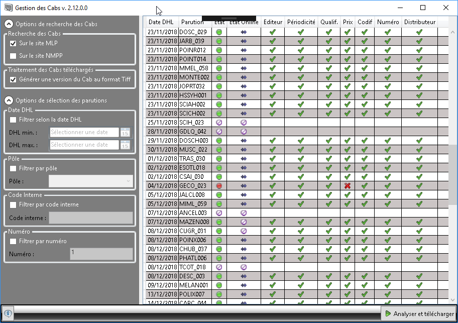

# CabOnline

Récupération, vérification et conversion des codes à barre MLP.

## Type de logiciel
CabOnline est une application Windows .Net Framework 4.6.2 avec interface graphique (WPF). 

## Déploiement et installation

Le déploiement et la mise à jour se font par ClickOnce.

## Objectif

CabOnline compare les CAB disponibles sur le site FTP MLP avec les CAB présents dans les dossiers de PAO.
Les CAB manquants sont téléchargés s'ils correspondent aux données de BDI (prix, périodicité,...) sinon
une anomalie est signalée.

